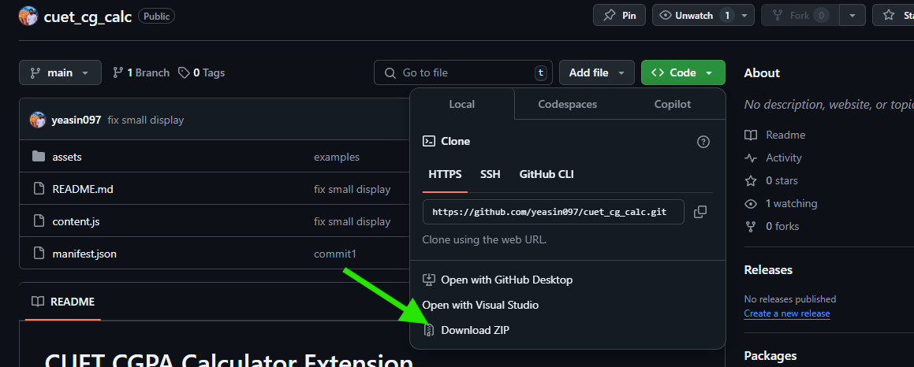
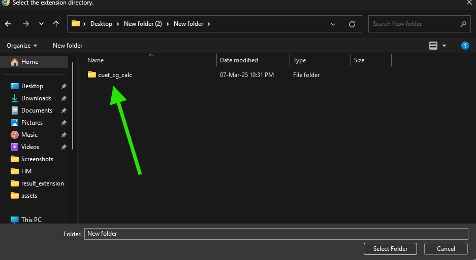
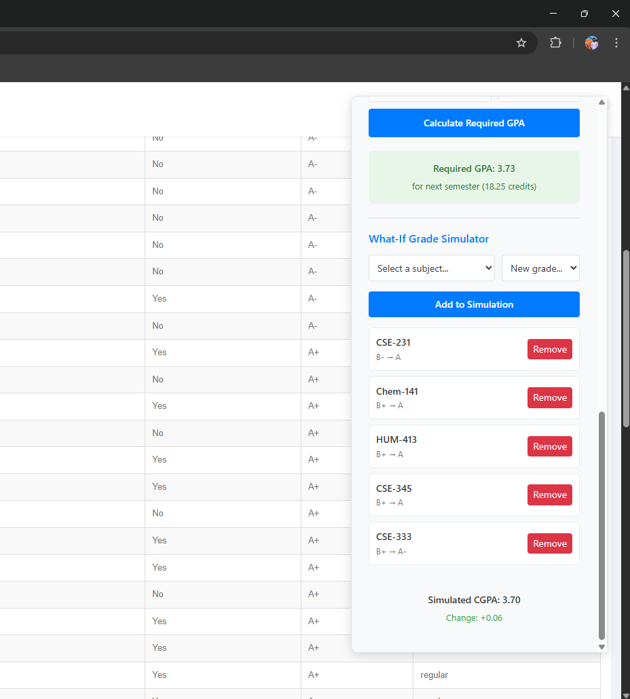

# CUET CGPA Calculator Extension

A Chrome extension that calculates your CGPA from the CUET course management system. This extension provides comprehensive grade analysis and CGPA calculation tools.

## Features

### 1. CGPA Calculation
- Term-wise CGPA calculation
- Overall CGPA calculation
- Handles repeated courses (uses the latest grade)
- Shows total credits completed

### 2. Grade Distribution Analysis
- Separate analysis for Theory and Lab courses
- Shows count of each grade (A+, A, A-, etc.)
- Visual representation of grade distribution
- Total count of theory and lab courses

### 3. Failed Subjects Tracking
- Lists all subjects that need to be cleared
- Shows subject code, credits, and term information
- Tracks improvement in retaken courses
- Displays unique failed subjects without duplicates

### 4. Target CGPA Calculator
- Calculate required GPA for next semester
- Enter target CGPA and next semester credits
- Shows if target is achievable

### 5. What-If Grade Simulator
- Simulate grade changes for any course
- Real-time CGPA recalculation
- Shows CGPA impact of grade improvements
- Multiple course simulation support
- Easy to add/remove simulated grades

### 6. CGPA Progress Chart
- Visual graph showing cumulative CGPA progress across semesters
- X-axis: Semester 1 to 8
- Y-axis: CGPA scale (0-4.0)
- Shows semester-wise CGPA data in a grid format
- Interactive chart with grid lines and data points
- Cumulative calculation: avgCGPAinTerm5 = (sum of product of credit and GPA of 5 semester)/total credit of 5 semester

## Installation Steps

### Method 1: Direct from GitHub
1. **Go to the GitHub Repository**
   - Visit `https://github.com/yeasin097/cuet_cg_calc`

2. **Download the Extension**
   - Click the green "Code" button at the top of the page
   - Select "Download ZIP" from the dropdown menu
   
   
   
   - Extract the downloaded ZIP file to a folder on your computer

### Method 2: Using Git
1. **Clone the Repository**
   ```bash
   git clone https://github.com/yeasin097/cuet_cg_calc.git
   ```

### Installing in Chrome
1. **Open Chrome Extensions Page**
   - Open Google Chrome
   - Type `chrome://extensions/` in the address bar
   - Press Enter

2. **Enable Developer Mode**
   - Look for the "Developer mode" toggle in the top-right corner
   - Turn it ON
   
   

3. **Load the Extension**
   - Click "Load unpacked" button in the top-left

      

   - Navigate to the folder containing the extension files
   - Select the folder and click "Open"

   
   

4. **Verify Installation**
   - You should see "CUET CGPA Calculator" in your extensions list
   - The extension icon should appear in your Chrome toolbar

   

## Usage

1. **Access Your Results**
   - Log in to course.cuet.ac.bd
   - Navigate to your results page

2. **Calculate CGPA**
    
    

   - Click the "Calculate CGPA" button in the top-right corner
   - Wait for the page to load all results
   - View your detailed CGPA breakdown
   
   

3. **Using Target Calculator**
   - Enter your next semester's total credits
   - Enter your target CGPA
   - Click "Calculate Required GPA"
   - See what GPA you need to achieve your target
   
   
   
   4. **Using What If Calculator**
   - Select one of the low-graded subjects
   - Enter the dream GPA
   - Click "Add to Simulation"
   
   

5. **Viewing CGPA Progress Chart**
   - The chart automatically appears when you calculate CGPA
   - View your cumulative CGPA progress across all semesters
   - See semester-wise CGPA values in the grid below the chart
   - Track your academic progress visually

## Usage Guide

### Basic CGPA Calculation
1. Navigate to the result page
2. Click "Calculate CGPA"
3. View term-wise and overall CGPA

### Using Grade Simulator
1. Select a subject from the dropdown
2. Choose a new grade
3. Click "Add to Simulation"
4. See how your CGPA would change
5. Add multiple subjects to simulate different scenarios

### Setting CGPA Targets
1. Enter your target CGPA
2. Input next semester's credits
3. See the required GPA to achieve your target

## Note
This extension only works on the CUET course management system (course.cuet.ac.bd). This is an enhanced version of my Python program from 2023 for calculating results. While the logic and algorithm remain the same, it has been improved and adapted into an extension. You can find the Python code and demo result.txt file in the old_python branch of this repository.


