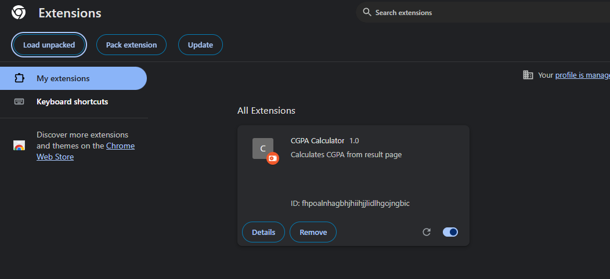

# CUET CGPA Calculator Extension

A Chrome extension that calculates your CGPA from the CUET course management system. Features include:
- Term-wise CGPA calculation
- Overall CGPA calculation
- Failed subjects tracking
- Target CGPA calculator for next semester

## Installation Steps

### Method 1: Direct from GitHub
1. **Go to the GitHub Repository**
   - Visit `https://github.com/yeasin097/cuet_cg_calc`

2. **Download the Extension**
   - Click the green "Code" button at the top of the page
   - Select "Download ZIP" from the dropdown menu
   - Extract the downloaded ZIP file to a folder on your computer

### Method 2: Using Git
1. **Clone the Repository**
   ```bash
   git clone https://github.com/yeasin097/cuet_cg_calc.git
   ```

### Installing in Chrome
1. **Open Chrome Extensions Page**
   - Open Google Chrome
   - Type `chrome://extensions/` in the address bar
   - Press Enter

2. **Enable Developer Mode**
   - Look for the "Developer mode" toggle in the top-right corner
   - Turn it ON
   
   

3. **Load the Extension**
   - Click "Load unpacked" button in the top-left
   - Navigate to the folder containing the extension files
   - Select the folder and click "Open"
   
   

4. **Verify Installation**
   - You should see "CUET CGPA Calculator" in your extensions list
   - The extension icon should appear in your Chrome toolbar

   

## Usage

1. **Access Your Results**
   - Log in to course.cuet.ac.bd
   - Navigate to your results page

2. **Calculate CGPA**
    
    

   - Click the "Calculate CGPA" button in the top-right corner
   - Wait for the page to load all results
   - View your detailed CGPA breakdown
   
   

3. **Using Target Calculator**
   - Enter your next semester's total credits
   - Enter your target CGPA
   - Click "Calculate Required GPA"
   - See what GPA you need to achieve your target
   
   

## Features

### CGPA Calculation
- Calculates term-wise and overall CGPA
- Handles repeated courses (uses the latest grade)
- Shows total credits completed

### Failed Subjects Tracking
- Lists all subjects that need to be cleared
- Shows subject code, credits, and term information

### Target CGPA Calculator
- Calculate required GPA for next semester
- Enter target CGPA and next semester credits
- Shows if target is achievable

## Troubleshooting

If the extension doesn't work:
1. Make sure you're on the correct results page
2. Try refreshing the page
3. Check if Developer mode is enabled
4. Try reinstalling the extension

## Note
This extension only works on the CUET course management system (course.cuet.ac.bd).
